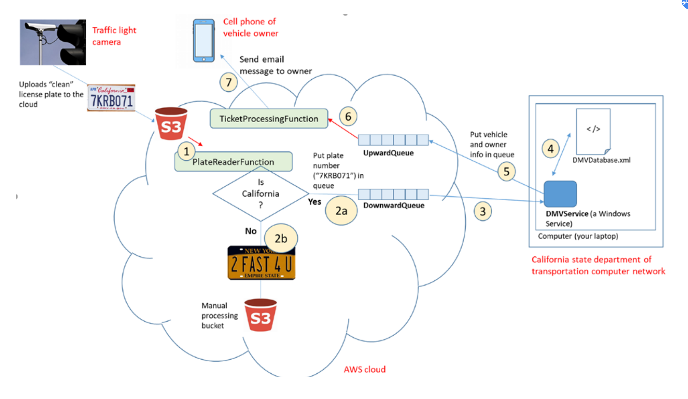

# Picense Plate processing


[toc]

## Problem Overview

need to development a system like below



The system will be installed in cities and towns in the state of California.

camera will take photos of license plate and put it into S3 ->Lambda will recognize it and to see if it belongs to California

then put message to MQ and Local Windows service will query DB(local xml file) to see this license plate's  owner and owner's info

then send email to this user for his illegal info


## Component Code


### Lambda

PlateReaderFunction

```
import boto3
import json
import re

def send_pic_to_manual_process_bucket(s3_client, bucket_name, key_name):
    manual_process_bucket = 'manual-processing-bucket-qingfeng-project3'
    copy_source = {
        'Bucket': bucket_name,
        'Key': key_name
        }

    s3_client.copy(copy_source, manual_process_bucket, key_name)
    print(f'send pic to {manual_process_bucket}')
    
def send_msg_to_mq(plate_number, metadata):
    client = boto3.client('sqs', region_name='us-east-1')
    response = client.send_message(
        QueueUrl='https://sqs.us-east-1.amazonaws.com/351629372403/DownwardQueue',
        MessageBody=json.dumps({'plate_number': plate_number, 'metadata': metadata})
    )
    print(response)

def parse_plate(bucket_name, key_name):
    client=boto3.client('rekognition', region_name = 'us-east-1')
    response = client.detect_text(Image={'S3Object':{'Bucket':bucket_name,'Name':key_name}})
    print(f'rekognition response:{response}')
    textDetections=response['TextDetections']
    text_list = []
    for text in textDetections:
        text_list.append(text['DetectedText'])
    detected_str = ' '.join(text_list)
    print(f'detected_str: {detected_str}')
    region_name = ''
    plate_number = ''
    try:
        region_name = re.findall('(California|Oregon|MICHIGAN|NEW YORK)', detected_str)[0]
    except Exception as e:
        print(f"failed to parse region_name, error:{e}")
    
    if region_name == 'California':
        plate_number = re.findall('[0-9][A-Z][A-Z0-9]{5}', detected_str)[0]
    

    return region_name, plate_number
    

def lambda_handler(event, context):
    
    aws_region = event['Records'][0]['awsRegion']
    bucket_name = event['Records'][0]['s3']['bucket']['name']
    key_name = event['Records'][0]['s3']['object']['key']

    
    s3_client = boto3.client('s3', region_name=aws_region)
    metadata = s3_client.head_object(Bucket= bucket_name, Key=key_name)['Metadata']
    print(f's3 file info: aws_region:{aws_region}, bucket_name:{bucket_name}, key_name:{key_name}, metadata:{metadata}')
    
    region_name, plate_number = parse_plate(bucket_name, key_name)
    print(f'parsed region_name:{region_name}, plate_number:{plate_number}')
    if region_name != 'California':
        send_pic_to_manual_process_bucket(s3_client, bucket_name, key_name)
    else:
        send_msg_to_mq(plate_number, metadata)


'''
meta_response

{'datetime': '5/26/2022 2:25:47 PM',
 'type': 'no_stop',
 'location': 'Main St and 116th AVE intersection, Bellevue'}
'''
```


TicketProcessingFunction

```python
import json
import smtplib
from email.header import Header
from email.mime.text import MIMEText
 

def send_email(content, email_receiver):
    mail_host = "smtp.163.com"  
    mail_user = "xxx@163.com" 
    mail_pass = "xxx" 
    
    sender = 'sender'
    receivers = [email_receiver]
    
    title = 'DMV Plate Detection'
 
    message = MIMEText(content, 'plain', 'utf-8') 
    message['From'] = "{}".format(sender)
    message['To'] = ",".join(receivers)
    message['Subject'] = title
 
    try:
        smtpObj = smtplib.SMTP_SSL(mail_host, 465) 
        smtpObj.login(mail_user, mail_pass) 
        smtpObj.sendmail(sender, receivers, message.as_string()) 
        print("mail has been send successfully.")
    except smtplib.SMTPException as e:
        print(f"send email failed to {email_receiver} with content: {content}, error:{e}")


def get_content(license_plate, language, violation_type, violation_date, vechicle, violation_address, ticket_amount):
    content = ''
    if language == "english":
        content = f'''
                Your vehicle was involved in a traffic violation. Please pay the specified ticket amount by 30  days: 

                Vehicle: {vechicle}
                License plate: {license_plate}
                Date: {violation_date}
                Violation address: {violation_address}
                Vilation type: {violation_type}
                Ticket amount: {ticket_amount}
                '''
    if language == "spanish":
        content = f'''
                Your vehicle was involved in a traffic violation. Please pay the specified ticket amount by 30  days: 

                Vehículo: {vechicle}
                Placa: {license_plate}
                Fecha: {violation_date}
                Dirección de infracción: {violation_address}
                Tipo de vilacion: {violation_type}
                Importe del billete: {ticket_amount}
                '''

    if language == "russian":
        content = f'''
                Your vehicle was involved in a traffic violation. Please pay the specified ticket amount by 30  days: 

                Средство передвижения: {vechicle}
                Номерной знак: {license_plate}
                Свидание: {violation_date}
                Адрес нарушения: {violation_address}
                Тип нарушения: {violation_type}
                Сумма билета: {ticket_amount}
                '''

    if language == "french":
        content = f'''
                Your vehicle was involved in a traffic violation. Please pay the specified ticket amount by 30  days: 

                Véhicule: {vechicle}
                Plaque d'immatriculation: {license_plate}
                Date: {violation_date}
                Adresse de l'infraction: {violation_address}
                Type de vila: {violation_type}
                Montant du billet: {ticket_amount}
                '''

    return content

def parse_plate_info(upqueue_message):
    license_plate = upqueue_message['plate_number']
    language = upqueue_message["preferredLanguage"]
    violation_type = upqueue_message["metadata"]["type"]
    violation_date = upqueue_message["metadata"]["datetime"]
    vechicle = upqueue_message["vehicle"] 
    violation_address = upqueue_message["metadata"]["location"]
    email_receiver = upqueue_message["contact"]
    return license_plate, language, violation_type, violation_date, vechicle, violation_address, email_receiver


def lambda_handler(event, context):
    print(f"event:{event}")
    message_list = event['Records']
    for message in message_list:
        upqueue_message = message['body']
        upqueue_message = json.loads(upqueue_message)
        
        license_plate, language, violation_type, violation_date, vechicle, violation_address, email_receiver = parse_plate_info(upqueue_message)
        ticket_amount = {'no_stop': '$300', 'no_full_stop_on_right': '$75', 'no_right_on_red': '$125'}[violation_type]

        email_content = get_content(license_plate, language, violation_type, violation_date, vechicle, violation_address, ticket_amount)
        print(f"content:{content}")
        send_email(email_content, email_receiver)
        print(f"send email successfully to {email_receiver} with content: {content}")

```


### Windows Service


```python
import xmltodict
import json
import boto3
import time

DownwardQueue_url = "https://sqs.us-east-1.amazonaws.com/351629372403/DownwardQueue"
UpwardQueue_url = "https://sqs.us-east-1.amazonaws.com/351629372403/UpwardQueue"
db_file = 'DMVDatabase.xml'
log_file = 'DMVService.log'

def log(*args, **kwargs):
    time_format = '%Y/%m/%d %H:%M:%S'
    localtime = time.localtime(int(time.time()))
    formatted = time.strftime(time_format, localtime)
    with open(log_file, 'a', encoding='utf-8') as f:
        print(formatted, *args, **kwargs)
        print(formatted, *args, file=f, **kwargs)

def receive_message(sqs_client):
    response = sqs_client.receive_message(
        QueueUrl=DownwardQueue_url,
        MaxNumberOfMessages=1,
        WaitTimeSeconds=10,
    )
    return response
    
def send_message(sqs_client, message):
    response = sqs_client.send_message(
        QueueUrl = UpwardQueue_url,
        MessageBody=json.dumps(message)
    )
    log(f"Posted message: {message}")
    print(response)

def delete_message(sqs_client, message):
    sqs_client.delete_message(
        QueueUrl=DownwardQueue_url,
        ReceiptHandle=message["ReceiptHandle"]
    )

def read_db_file(file_name):
    with open(file_name) as fd:
        doc = xmltodict.parse(fd.read())
    return doc

def query_db(plate_dict, message_body):
    # {'plate_number': '1', 'metadata': {}}
    plate_number = message_body['plate_number']
    vehicle_list = plate_dict['dmv']['vehicle']
    upqueue_message = message_body
    for vehicle in vehicle_list:
        print(vehicle)
        if vehicle['@plate'] == plate_number:
            print(f"plate {vehicle['@plate']}, {vehicle['make']} {vehicle['model']} {vehicle['color']}") 
            # if patient in database then send message to UpwardQueue
            upqueue_message["vehicle"] = f"{vehicle['make']} {vehicle['model']} {vehicle['color']}"
            upqueue_message["preferredLanguage"] = vehicle['owner']['@preferredLanguage']
            upqueue_message["name"] = vehicle['owner']['name']
            upqueue_message["contact"] = vehicle['owner']['contact']
    return upqueue_message

def main():
    sqs_client = boto3.client("sqs", region_name="us-east-1")
    plate_dict = read_db_file(db_file)

    while True:
        print("receiving message")
        message_response = receive_message(sqs_client)
        message_count = len(message_response.get('Messages', []))
        if message_count > 0:
            for message in message_response.get("Messages", []):
                message_body = json.loads(message["Body"])
                log(f"Read message: {message_body}")
                upqueue_message = query_db(plate_dict, message_body)
                send_message(sqs_client, upqueue_message)

                delete_message(sqs_client, message)
        time.sleep(1)

main()


```


upload pic to s3 with metadata

```
import boto3
import random

client = boto3.client('s3')
bucket_name = 'qingfeng-project3'

pic_list = [
    "cal_plate1_english.jpg",
    "cal_plate5_english.jpg",
    "cal_plate2_spanish.jpg",
    "michigan_plate6.jpg",
    "cal_plate3_russian.jpg",
     "ny_plate7.jpg",
    "cal_plate4_french.jpg",
    "oregon_plate8.jpg"
    ]

print(pic_list)
for filename in pic_list:
    response = client.upload_file(
        Filename=f'./plates_reducedSized/{filename}',
        Bucket= bucket_name,
        Key=filename,
        ExtraArgs={"Metadata": {
            "Location": "Main St and 116th AVE intersection, Bellevue",
            "DateTime": "5/26/2022 2:25:47 PM",
            "Type": random.choice(["no_stop", "no_full_stop_on_right", "no_right_on_red"])
            }}
    )
    print(response)

```


### XML File


DMVDatabase.xml

```
<dmv>
    <vehicle plate="6TRJ244">
        <make>Ford</make>
        <model>Focus</model>
        <color>Red</color>
        <owner preferredLanguage="english">
            <name>John Smith</name>
            <contact>timtike@163.com</contact>
        </owner>
    </vehicle>
    <vehicle plate="5ALN015">
        <make>Honda</make>
        <model>Civic</model>
        <color>Blue</color>
        <owner preferredLanguage="spanish">
            <name>Jose Garcia</name>
            <contact>timtike@163.com</contact>
        </owner>
    </vehicle>
    <vehicle plate="7TRR812">
        <make>Jeep</make>
        <model>Wrangler</model>
        <color>Yellow</color>
        <owner preferredLanguage="russian">
            <name>Vladimir Lavrov</name>
            <contact>timtike@163.com</contact>
        </owner>
    </vehicle>
    <vehicle plate="3ZZB646">
        <make>Honda</make>
        <model>CRV</model>
        <color>Silver</color>
        <owner preferredLanguage="french">
            <name>Chantal Barbier</name>
            <contact>timtike@163.com</contact>
        </owner>
    </vehicle>
    <vehicle plate="6YMX832">
        <make>Chevrolet</make>
        <model>Cruze</model>
        <color>Red</color>
        <owner preferredLanguage="english">
            <name>Tim Carpenter</name>
            <contact>timtike@163.com</contact>
        </owner>
    </vehicle>
</dmv>
```

