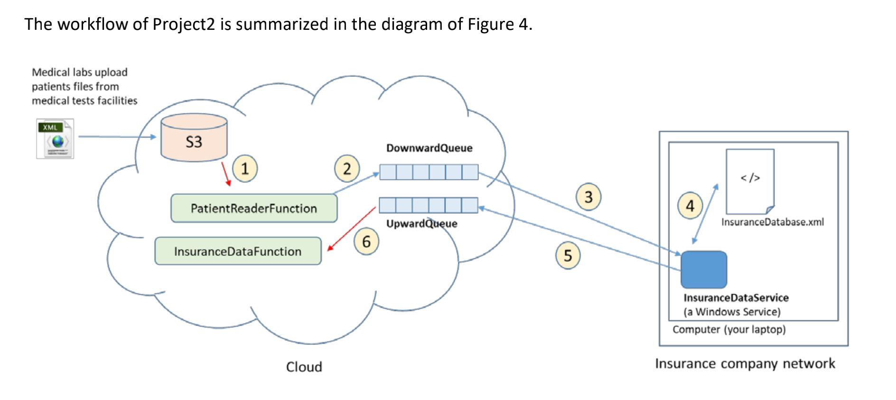
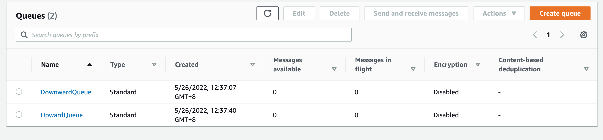
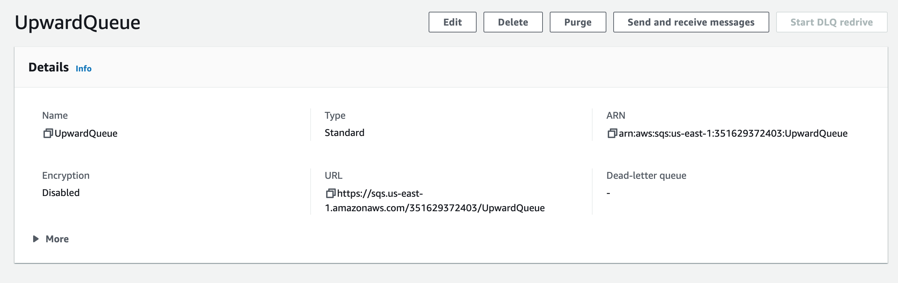

# Patient 

[toc]

## Problem Overview



**Figure 4**: Workflow diagram. Note that red arrows represent event triggers.

```
1. Medical labs drop patient files in an S3 bucket (3 patient files were given to you for testing: 
patient1.xml, patient2.xml, and patient3.xml).

2. A lambda function (PatientReaderFunction) is listening to PUT events on the above bucket and extracts the data from such files. There is one missing piece of information that is not in the XML: details of the patient’s insurance policy. This information is only available in the insurance company database (InsuranceDatabase.xml), located inside the insurance company network.

3. PatientReaderFunction put a JSON message in the DownwardQueue with the patient ID it reads from the XML.

4. The InsuranceDataService polls the DownwardQueue for incoming messages (using long-polling – more on that in the Implementation Hints section). When it reads a message, it queries the local database (InsuranceDatabase.xml) to check if the patient has insurance or not.It then deletes the message from the DownwardQueue and responds back by putting a response message (in JSON) in the UpwardQueue. The response should have the patient ID and whether the patient has insurance or not. If the patient has insurance, the policy number and insurance provider should be returned as well.

5. The second Lambda function (InsuranceDataFunction) is listening via a notification trigger to messages that arrive at the UpwardQueue. When a message arrives, it retrieves it, parses it, and prints information to CloudWatch. 

```

It should print the following: 

> Patient with ID xyz does not have medical insurance
>
> or
>
> Patient with ID xyz: policyNumber=aaaaa, provider=bbbbb

```
where aaaaa and bbbbb are the policy number and insurance provider name, respectively.
InsuranceDataFunction should then delete the message from the UpwardQueue.

6. The service (the blue rectangle in Figure 4) should print to a log file the following message every time it reads a message from the DownwardQueue:

```

> Date: Read message: { … JSON of the message … }
>
> And the following every time it posts a message to the UpwardQueue:
>
> Date: Posted message: { … JSON of the returned message … }


## Component Code

### Lambda 


PatientReaderFunction

```
import boto3
import json
import xmltodict

def download_s3_file(region_name, bucket_name, key_name):

    s3_client = boto3.client('s3', region_name=region_name)
    s3_client.download_file(bucket_name, key_name, '/tmp/' + key_name)

def parse_xml(xml_file):
    with open(f'/tmp/{xml_file}') as fd:
        doc = xmltodict.parse(fd.read())

    # {'patient': {'id': '10001', 'name': 'John Smith'}}
    patient_id = doc['patient']['id']
    patient_name = doc['patient']['name']
    return patient_id, patient_name

def send_msg_to_mq(patient_id, patient_name):
    client = boto3.client('sqs', region_name='us-east-1')
    response = client.send_message(
        QueueUrl='https://sqs.us-east-1.amazonaws.com/351629372403/DownwardQueue',
        MessageBody=json.dumps({'patient_id': patient_id, 'patient_name': patient_name})
    )
    print(response)

def lambda_handler(event, context):
    region_name = event['Records'][0]['awsRegion']
    bucket_name = event['Records'][0]['s3']['bucket']['name']
    key_name = event['Records'][0]['s3']['object']['key']

    print(f's3 file info: region_name:{region_name}, bucket_name:{bucket_name}, key_name:{key_name}')
    
    download_s3_file(region_name, bucket_name, key_name)
    patient_id, patient_name = parse_xml(key_name)
    send_msg_to_mq(patient_id, patient_name)

```

> need to install xmltodict
>
> pip3 install -t $PWD xmltodict


InsuranceDataFunction

```
import json

def lambda_handler(event, context):
    print(f"event:{event}")
    message_list = event['Records']
    for message in message_list:
        upqueue_message = message['body']
        upqueue_message = json.loads(upqueue_message)
        '''
        upqueue_message = {
        "patient_id": 10001, 
        "patient_name": "John Smith", 
        "have_insurance": True,
        "policyNumber": "AFF-234-667788", 
        "provider": "Liberty Mutual"
        '''
        patient_id = upqueue_message['patient_id']
        patient_name = upqueue_message['patient_name']
        if upqueue_message['have_insurance']:
            policyNumber = upqueue_message['policyNumber']
            provider = upqueue_message['provider']
            print(f"Patient with {patient_id} {patient_name}: policyNumber={policyNumber}, provider={provider}")
        else:
            print(f"Patient with {patient_id} {patient_name} does not have medical insurance ")
        
        

```


### Queue






Access policy (Permissions)

```
{
  "Version": "2008-10-17",
  "Id": "__default_policy_ID",
  "Statement": [
    {
      "Sid": "__owner_statement",
      "Effect": "Allow",
      "Principal": "*",
      "Action": "SQS:*",
      "Resource": "arn:aws:sqs:us-east-1:351629372403:UpwardQueue"
    }
  ]
}
```


### Windows service

InsuranceDataService

```
import xmltodict
import json
import boto3
import time

DownwardQueue_url = "https://sqs.us-east-1.amazonaws.com/351629372403/DownwardQueue"
UpwardQueue_url = "https://sqs.us-east-1.amazonaws.com/351629372403/UpwardQueue"
db_file = 'InsuranceDatabase.xml'
log_file = 'InsuranceDataService.log'

def log(*args, **kwargs):
    time_format = '%Y/%m/%d %H:%M:%S'
    localtime = time.localtime(int(time.time()))
    formatted = time.strftime(time_format, localtime)
    with open(log_file, 'a', encoding='utf-8') as f:
        print(formatted, *args, **kwargs)
        print(formatted, *args, file=f, **kwargs)

def receive_message(sqs_client):
    response = sqs_client.receive_message(
        QueueUrl=DownwardQueue_url,
        MaxNumberOfMessages=1,
        WaitTimeSeconds=10,
    )
    return response
    
def send_message(sqs_client, message):
    response = sqs_client.send_message(
        QueueUrl = UpwardQueue_url,
        MessageBody=json.dumps(message)
    )
    log(f"Posted message: {message}")
    print(response)

def delete_message(sqs_client, message):
    sqs_client.delete_message(
        QueueUrl=DownwardQueue_url,
        ReceiptHandle=message["ReceiptHandle"]
    )

def read_db_file(file_name):
    with open(file_name) as fd:
        doc = xmltodict.parse(fd.read())
    return doc

def query_db(patient_dict, message_body):
    # 'patient_id': '1', 'patient_name': 'John Smith'}
    patient_id = message_body['patient_id']
    patient_name = message_body['patient_name']
    patient_list = patient_dict['insuranceDatabase']['patient']
    have_insurance = False
    upqueue_message = {"patient_id": patient_id, "patient_name": patient_name}
    for patient in patient_list:
        if patient['@id'] == patient_id:
            have_insurance = True
            print(f"Patient with {patient_id} {patient_name}: policyNumber={patient['policy']['@policyNumber']}, provider={patient['policy']['provider']}")
            # if patient in database then send message to UpwardQueue
            upqueue_message["policyNumber"] = patient['policy']['@policyNumber']
            upqueue_message["provider"] = patient['policy']['provider']

    upqueue_message["have_insurance"] = have_insurance
    if not have_insurance:
        print(f"Patient with {patient_id} {patient_name} does not have medical insurance ")
    return upqueue_message

def main():
    sqs_client = boto3.client("sqs", region_name="us-east-1")
    patient_dict = read_db_file(db_file)
    '''
    {'insuranceDatabase': {'patient': [{'@id': '10001', 'policy': {'@policyNumber': 'AFF-234-667788', 'provider': 'Liberty Mutual'}}, {'@id': '10003', 'policy': {'@policyNumber': 'DCH-776-334455', 'provider': 'State Farm'}}]}}
    '''

    while True:
        print("receiving message")
        message_response = receive_message(sqs_client)
        message_count = len(message_response.get('Messages', []))
        if message_count > 0:
            for message in message_response.get("Messages", []):
                message_body = json.loads(message["Body"])
                log(f"Read message: {message_body}")
                upqueue_message = query_db(patient_dict, message_body)
                send_message(sqs_client, upqueue_message)

                delete_message(sqs_client, message)
        time.sleep(1)

main()

```


### XML file

InsuranceDatabase.xml

```
<insuranceDatabase>
    <patient id="10001">
        <policy policyNumber="AFF-234-667788">
            <provider>Liberty Mutual</provider>
        </policy>
    </patient>
    <patient id="10003">
        <policy policyNumber="DCH-776-334455">
            <provider>State Farm</provider>
        </policy>
    </patient>
</insuranceDatabase>
```

patient1.xml

```
<patient>
    <id>10001</id>
    <name>John Smith</name>
</patient>
```

patient2.xml

```
<patient>
    <id>10002</id>
    <name>Sandra Summer</name>
</patient>
```

patient3.xml

```
<patient>
    <id>10003</id>
    <name>Dawn Fink</name>
</patient>
```

