[toc]

# Arch


the workflow is like this:

user updoad a image in website -> upload to S3 -> trigger SNS -> trigger 3 Lambda to convert image to 3 size -> put resized image to corresponding S3 bucket ->show resized image in Frontend

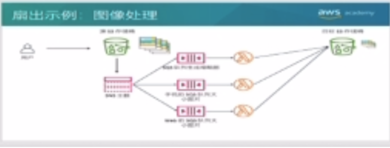

# Web Service

> pip3 install flask

> reference link:https://flask.palletsprojects.com/en/2.1.x/patterns/fileuploads/


start service

```
python3 main.py
```

access service

```
127.0.0.1:5000
```


```
web_service
├── app.py
├── image
│   ├── login.jpg
│   ├── login3.jpeg
│   └── stone.jpeg
├── main.py
└── templates
    └── upload.html
```


templates/upload.html

```
<!doctype html>
<title>Process Image</title>
<h2>Select image to convert</h2>

<form method="post" action="/" enctype="multipart/form-data">
    <dl>
		<p>
			<input type="file" name="files[]" multiple="true" autocomplete="off" required>
		</p>
    </dl>
    <p>
		<input type="submit" value="Submit">
	</p>
</form>


	
		<div>
			<p>{{ filename.name }}</p>
			
		</div>
	

```


app.py

```
from flask import Flask

app = Flask(__name__)
app.secret_key = "secret key"

```


main.py

```python
import os
import time
from app import app
import urllib.request
from flask import Flask, flash, request, redirect, url_for, render_template
from werkzeug.utils import secure_filename

import boto3
s3_client = boto3.client('s3')
input_s3 = 'zhenwei-image-input'

web_image_size_prefix = '700x300'
mobile_image_size_prefix = '300x200'
thumbnail_image_size_prefix = '200x100'

@app.route('/')
def upload_form():
	return render_template('upload.html')

def upload_image_to_s3(image_name):
	s3_client.upload_file("./image/"+image_name, input_s3, image_name)

@app.route('/', methods=['POST'])
def upload_image():
	if 'files[]' not in request.files:
		flash('No file')
	file = request.files.getlist('files[]')[0]
	file_names = []
	if file:
		filename = secure_filename(file.filename)
		upload_image_to_s3(filename)
		file.save(os.path.join('./image', filename))

		file_names = [
		{'name':'web', 'url':f'https://zhenwei-image-output.s3.ap-southeast-1.amazonaws.com/{web_image_size_prefix}{filename}'},
		{'name':'mobile', 'url':f'https://zhenwei-image-output.s3.ap-southeast-1.amazonaws.com/{mobile_image_size_prefix}{filename}'},
		{'name':'thumbnail', 'url':f'https://zhenwei-image-output.s3.ap-southeast-1.amazonaws.com/{thumbnail_image_size_prefix}{filename}'},
		]
		time.sleep(3)
	return render_template('upload.html', filenames=file_names)

if __name__ == "__main__":
	app.run()


```


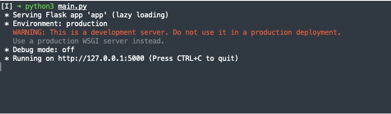

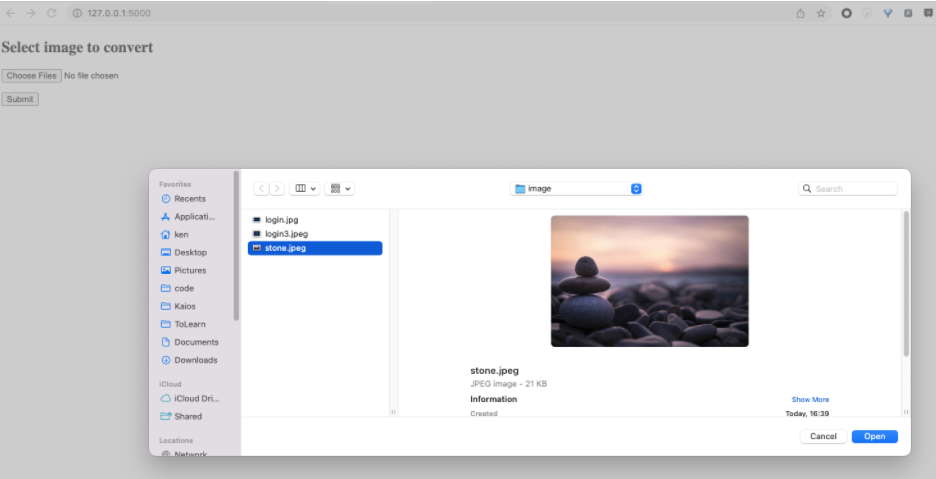

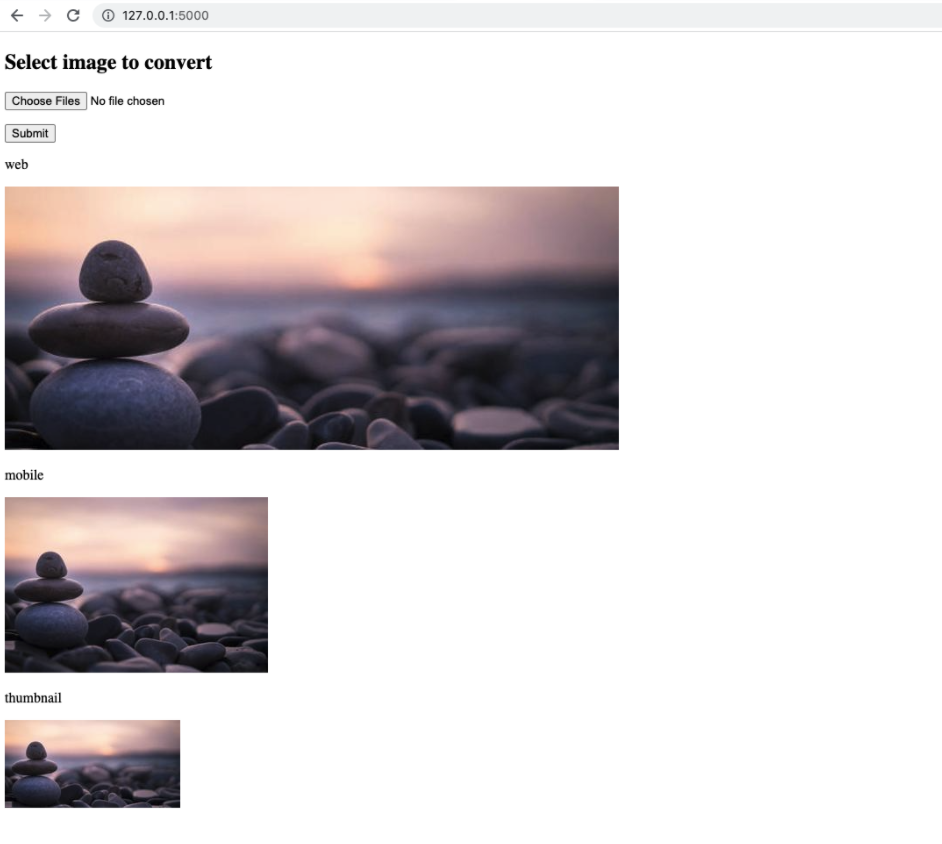


# Lambda

> pip3 install -t $PWD python-resize-image
>
> zip folder to zip file and upload to lambda


## resize-image-web

lambda_function.py

```
from PIL import Image
from resizeimage import resizeimage
import json
import boto3

s3_client = boto3.client('s3')
output_s3 = 'zhenwei-image-output'

web_image_size = [700, 300]
web_image_size_prefix = '700x300'
mobile_image_size = [300, 200]
mobile_image_size_prefix = '300x200'
thumbnail_image_size = [200, 100]
thumbnail_image_size_prefix = '200x100'


def resize_image_size(local_image_path, image_name, image_size, name_prefix):
    new_image_name = name_prefix+image_name
    fd_img = open(local_image_path+image_name, 'rb')
    img = Image.open(fd_img)
    img = resizeimage.resize_cover(img, image_size)

    img.save(local_image_path+new_image_name, img.format)
    print('saved new image', local_image_path+new_image_name)
    fd_img.close()
    return new_image_name


def lambda_handler(event, context):
    print(f"event:{event}")
    local_image_path = '/tmp/'
    message_list = event['Records']
    for message in message_list:
        queue_message = message['body']
        queue_message = json.loads(queue_message)
        s3_event_message = json.loads(queue_message['Message'])
  
        image_bucket = s3_event_message['Records'][0]['s3']['bucket']['name']
        image_name = s3_event_message['Records'][0]['s3']['object']['key']
        print(image_bucket, image_name)

        s3_client.download_file(image_bucket, image_name, local_image_path+image_name)
        new_image_name = resize_image_size(local_image_path, image_name, web_image_size, web_image_size_prefix)
        s3_client.upload_file(local_image_path+new_image_name, output_s3, new_image_name)
        print(f'upload {new_image_name} success')


```

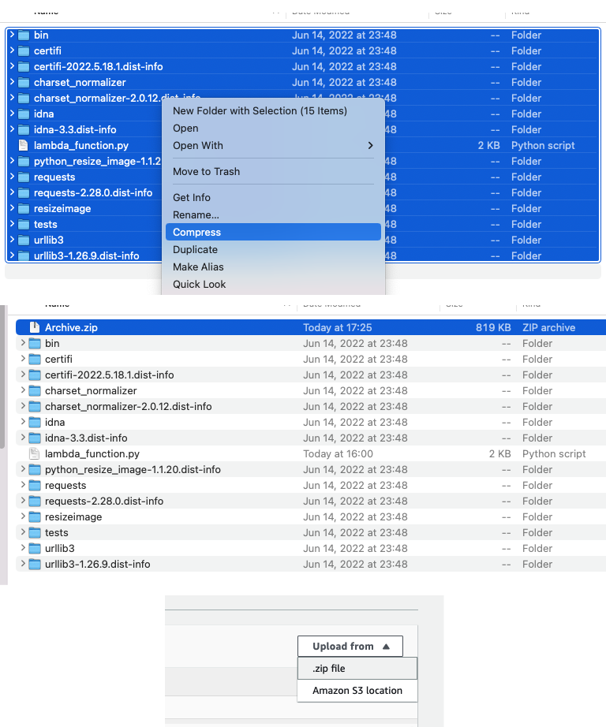


add layer for pillow

```
arn:aws:lambda:ap-southeast-1:770693421928:layer:Klayers-python38-Pillow:15
```


## resize-image-mobile

```
from PIL import Image
from resizeimage import resizeimage
import json
import boto3

s3_client = boto3.client('s3')
output_s3 = 'zhenwei-image-output'

web_image_size = [700, 300]
web_image_size_prefix = '700x300'
mobile_image_size = [300, 200]
mobile_image_size_prefix = '300x200'
thumbnail_image_size = [200, 100]
thumbnail_image_size_prefix = '200x100'


def resize_image_size(local_image_path, image_name, image_size, name_prefix):
    new_image_name = name_prefix+image_name
    fd_img = open(local_image_path+image_name, 'rb')
    img = Image.open(fd_img)
    img = resizeimage.resize_cover(img, image_size)

    img.save(local_image_path+new_image_name, img.format)
    print('saved new image', local_image_path+new_image_name)
    fd_img.close()
    return new_image_name


def lambda_handler(event, context):
    print(f"event:{event}")
    local_image_path = '/tmp/'
    message_list = event['Records']
    for message in message_list:
        queue_message = message['body']
        queue_message = json.loads(queue_message)
        s3_event_message = json.loads(queue_message['Message'])
  
        image_bucket = s3_event_message['Records'][0]['s3']['bucket']['name']
        image_name = s3_event_message['Records'][0]['s3']['object']['key']
        print(image_bucket, image_name)

        s3_client.download_file(image_bucket, image_name, local_image_path+image_name)
        new_image_name = resize_image_size(local_image_path, image_name, mobile_image_size, mobile_image_size_prefix)
        s3_client.upload_file(local_image_path+new_image_name, output_s3, new_image_name)
        print(f'upload mobile {new_image_name} success')


```

## resize-image-thumbnail

```
from PIL import Image
from resizeimage import resizeimage
import json
import boto3

s3_client = boto3.client('s3')
output_s3 = 'zhenwei-image-output'

web_image_size = [700, 300]
web_image_size_prefix = '700x300'
mobile_image_size = [300, 200]
mobile_image_size_prefix = '300x200'
thumbnail_image_size = [200, 100]
thumbnail_image_size_prefix = '200x100'


def resize_image_size(local_image_path, image_name, image_size, name_prefix):
    new_image_name = name_prefix+image_name
    fd_img = open(local_image_path+image_name, 'rb')
    img = Image.open(fd_img)
    img = resizeimage.resize_cover(img, image_size)

    img.save(local_image_path+new_image_name, img.format)
    print('saved new image', local_image_path+new_image_name)
    fd_img.close()
    return new_image_name


def lambda_handler(event, context):
    print(f"event:{event}")
    local_image_path = '/tmp/'
    message_list = event['Records']
    for message in message_list:
        queue_message = message['body']
        queue_message = json.loads(queue_message)
        s3_event_message = json.loads(queue_message['Message'])
  
        image_bucket = s3_event_message['Records'][0]['s3']['bucket']['name']
        image_name = s3_event_message['Records'][0]['s3']['object']['key']
        print(image_bucket, image_name)

        s3_client.download_file(image_bucket, image_name, local_image_path+image_name)
        new_image_name = resize_image_size(local_image_path, image_name, thumbnail_image_size, thumbnail_image_size_prefix)
        s3_client.upload_file(local_image_path+new_image_name, output_s3, new_image_name)
        print(f'upload thumbnail {new_image_name} success')


```


# SQS


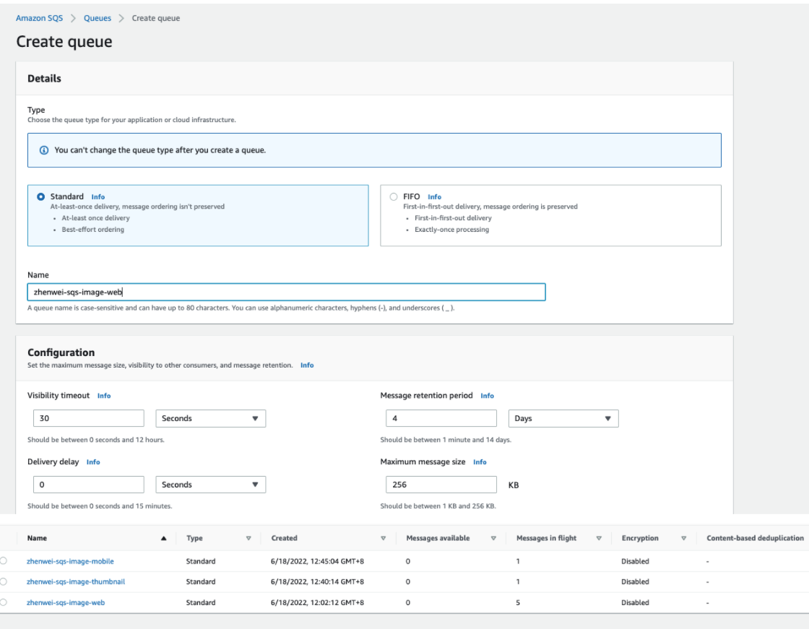


# SNS

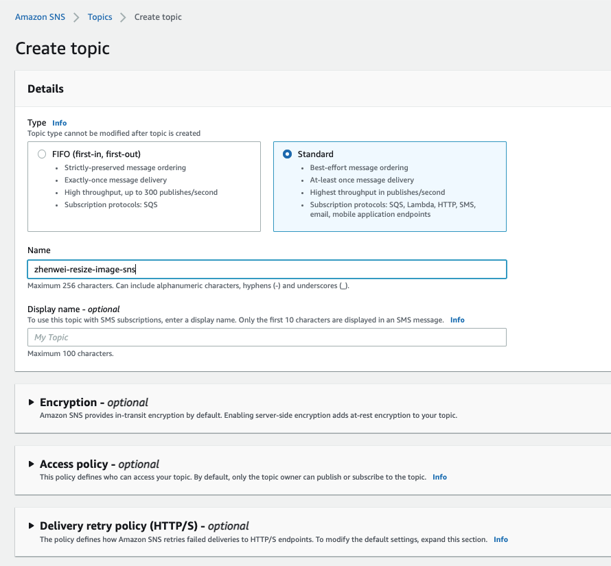


add subscription for 3 SQS

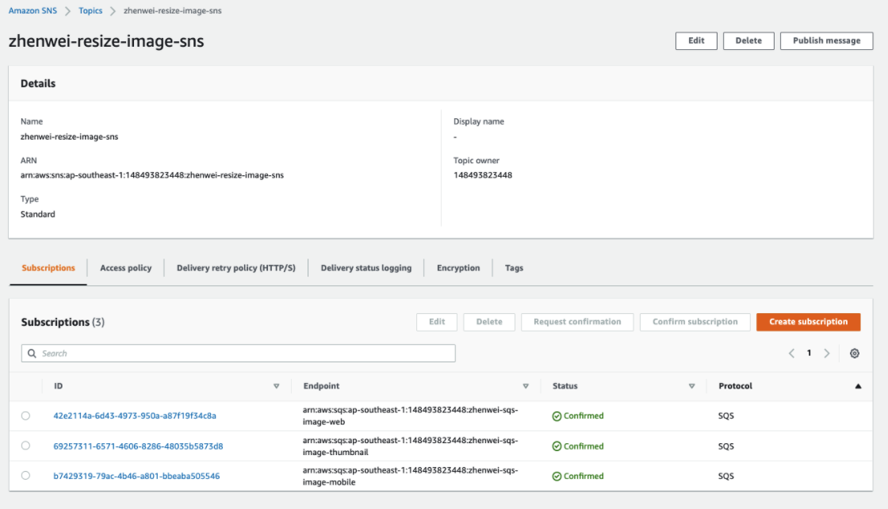


sns access policy, remove condition then can add event in s3

```
{
  "Version": "2008-10-17",
  "Id": "__default_policy_ID",
  "Statement": [
    {
      "Sid": "__default_statement_ID",
      "Effect": "Allow",
      "Principal": {
        "Service": "s3.amazonaws.com"
      },
      "Action": [
        "SNS:GetTopicAttributes",
        "SNS:SetTopicAttributes",
        "SNS:AddPermission",
        "SNS:RemovePermission",
        "SNS:DeleteTopic",
        "SNS:Subscribe",
        "SNS:ListSubscriptionsByTopic",
        "SNS:Publish"
      ],
      "Resource": "arn:aws:sns:ap-southeast-1:148493823448:zhenwei-resize-image-sns"
    }
  ]
}
```


# S3


to enable picture can be access by public
1.unblock public access
2.add bucket policy

{
    "Version": "2012-10-17",
    "Id": "Policy1630308254677",
    "Statement": [
        {
            "Sid": "Access-to-VPC-only",
            "Effect": "Allow",
            "Principal": "*",
            "Action": "s3:*",
            "Resource": "arn:aws:s3:::bucket-name/*"
        }
    ]
}


Input

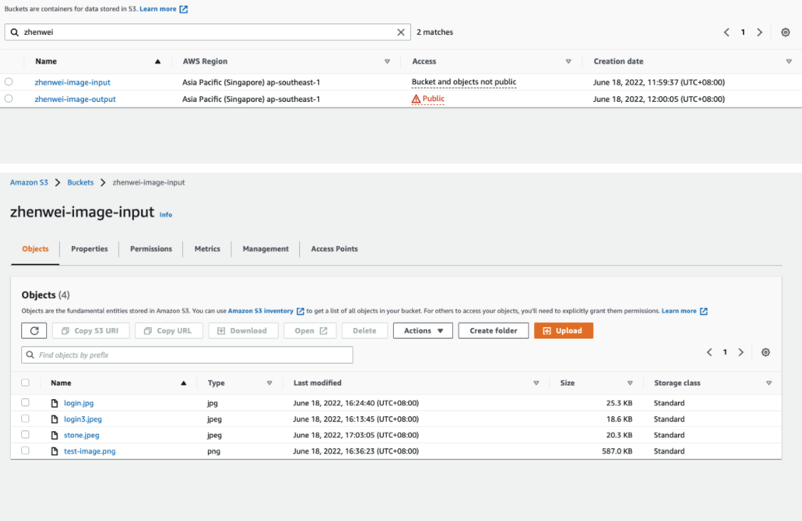


Output

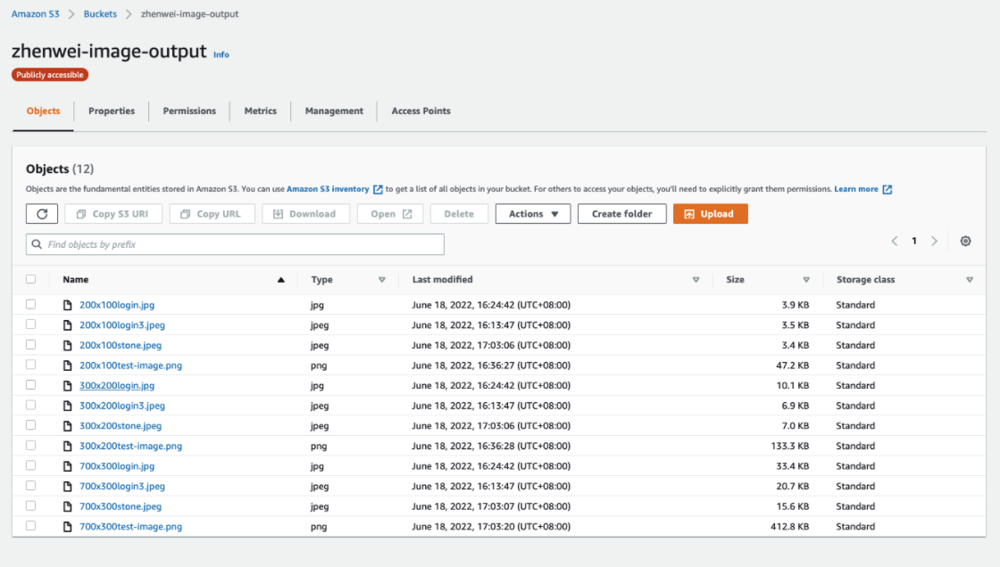


add SNS Event notification for bucket zhenwei-image-input

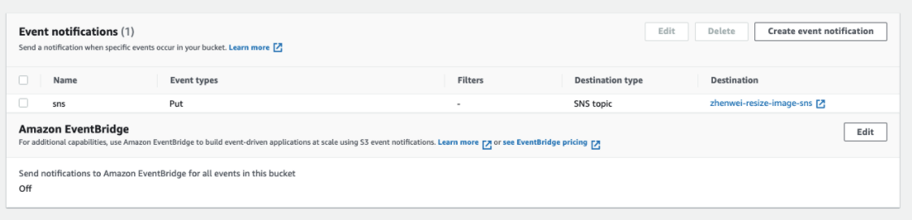


